# 💡 Giải pháp chăm sóc khách hàng bằng LLM cho doanh nghiệp dịch vụ nhỏ

> **Nền tảng nhắn tin CSKH sử dụng kiến trúc RAG & Multi-Agent**

---

## 📑 Mục lục

- [1. Phân tích thiết kế](#1-phân-tích-thiết-kế)
- [2. Xây dựng sản phẩm](#2-xây-dựng-sản-phẩm)
- [3. Hướng dẫn cài đặt](#3-hướng-dẫn-cài-đặt)
---

## 🚀 Tính năng nổi bật

- **Dịch vụ nhắn tin chuyên biệt cho CSKH**
- **Agent phản hồi nghiệp vụ:** hỏi đáp, lên đơn
- **Agent chuyển tiếp:** các yêu cầu vượt quá khả năng & khiếu nại
- **Tự động trích xuất thông tin khách hàng**
- **Tự động lên đơn khi phát hiện nhu cầu**

---

## 🖥️ Giao diện hệ thống

### Khách hàng
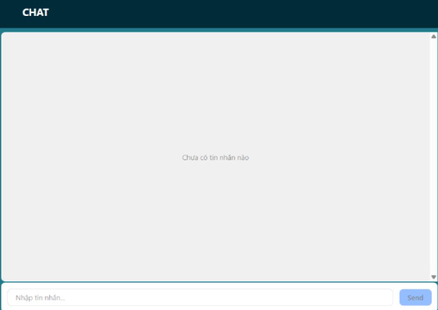
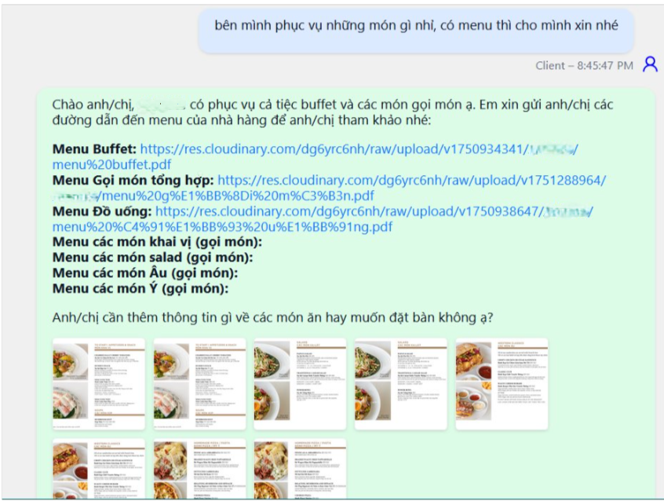

### Nhân viên
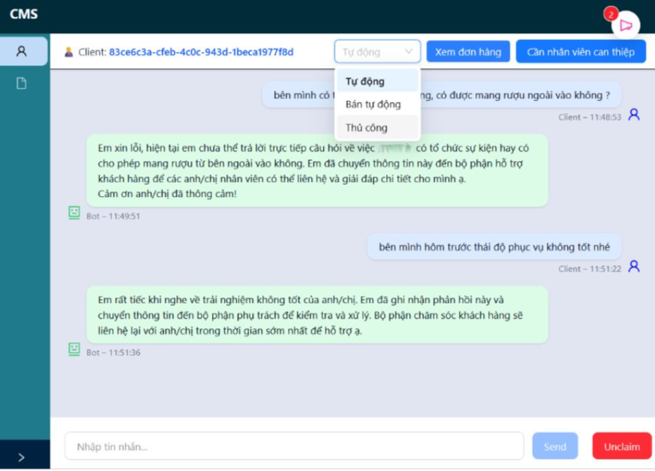

**Chế độ vận hành:**

| Chế độ   | Mô tả |
|----------|-------|
| **Auto** | Agent tương tác trực tiếp với khách hàng |
| **Manual** | Agent hỗ trợ quyết định cho nhân viên |

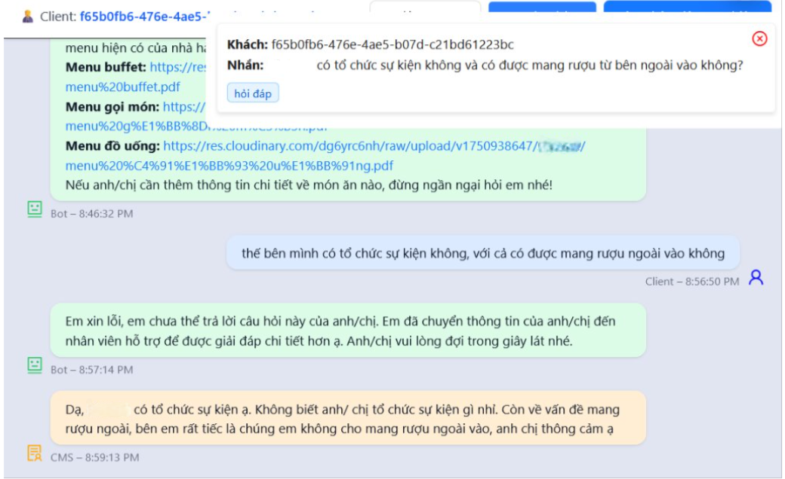
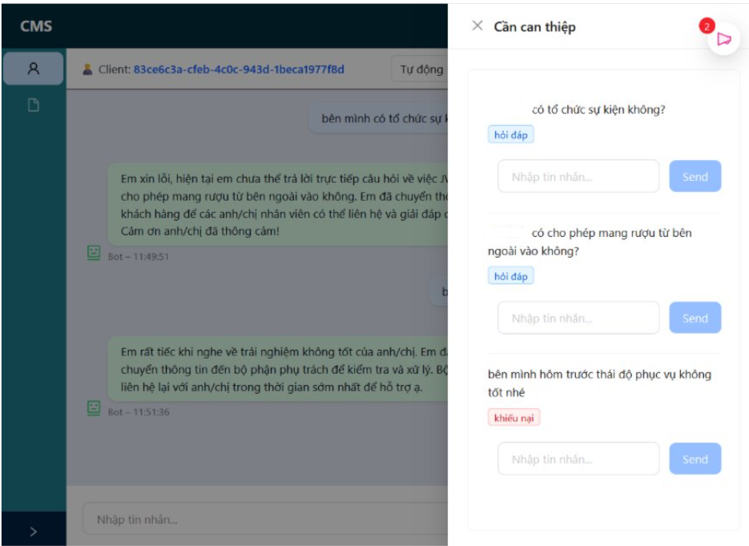

> 💬 **Tin nhắn không trả lời được (RAG không ra kết quả) sẽ lưu lại để nhân viên xử lý.**

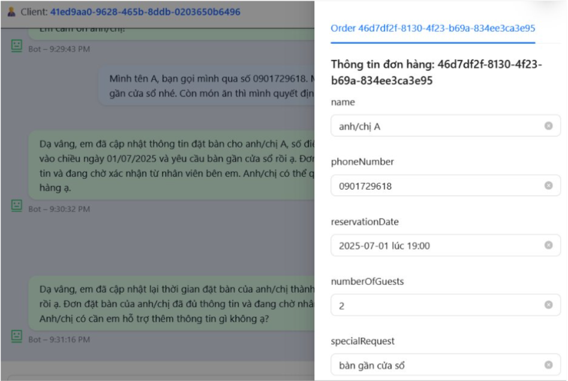

**Thông tin khách hàng trích xuất hiển thị trong khung chat:**
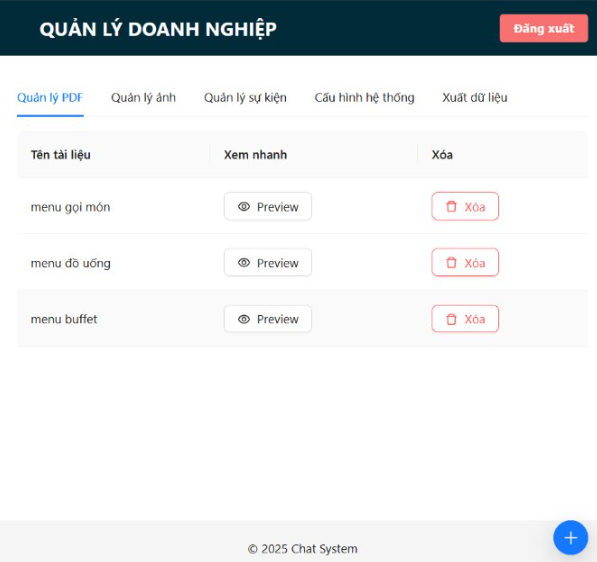


---


## 1. Phân tích thiết kế

### Tổng quan Usecase
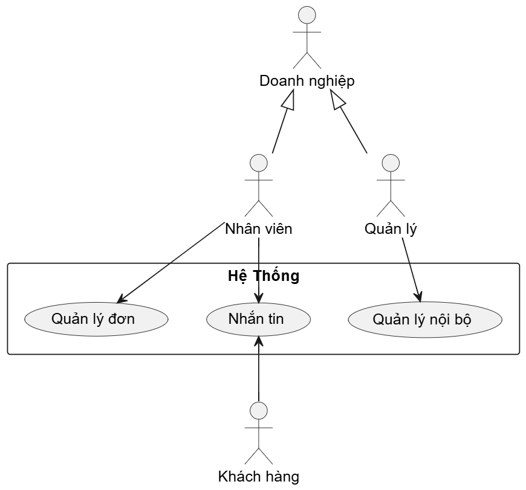

**Ba tác nhân chính:**

- Nhân viên
- Quản lý doanh nghiệp
- Khách hàng

### Usecase nhắn tin
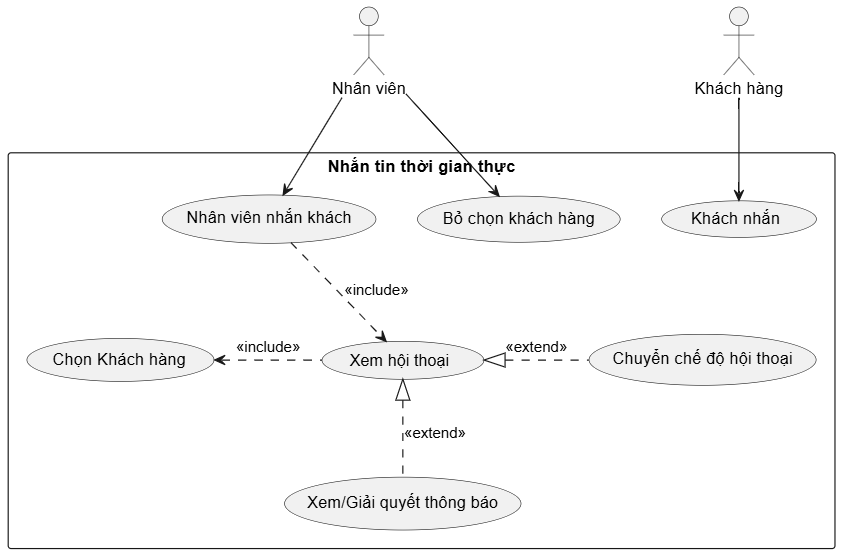

**Logic:**
- Đảm bảo tại một thời điểm, một khách chỉ nhắn với một nhân viên
- Agent phản hồi dựa trên chế độ hội thoại

### Usecase quản lý đơn
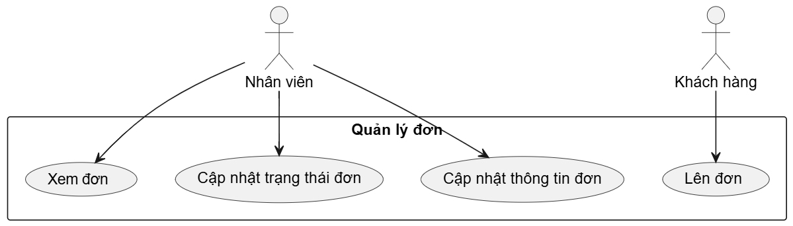

**Logic:**
- Agent trích xuất thông tin từ hội thoại
- Nhận biết ý định lên đơn và tạo đơn

---

## 2. Xây dựng sản phẩm

### Cấu trúc thư mục
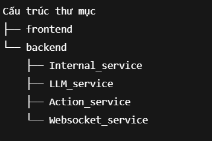

### Tổng quan dự án


### Cấu trúc backend server
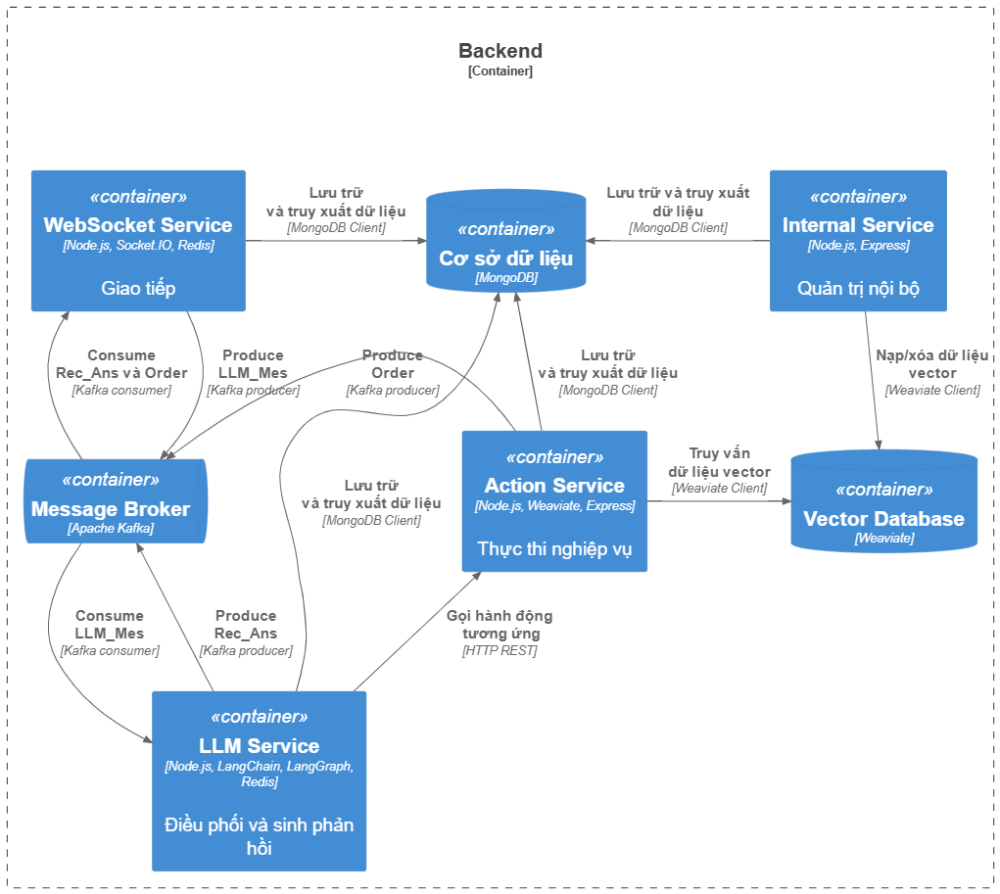

#### Chat Server
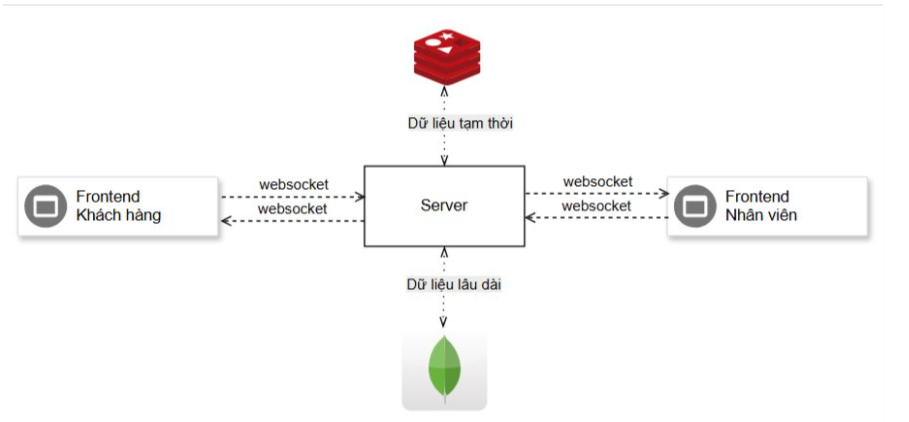

---

### 🗄️ Tổ chức dữ liệu

#### Redis
**Cấu trúc:**

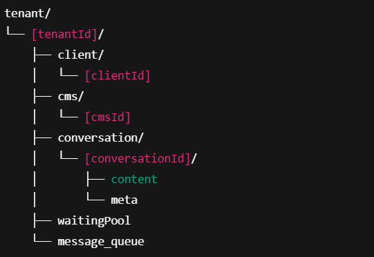

**Chi tiết schema:**

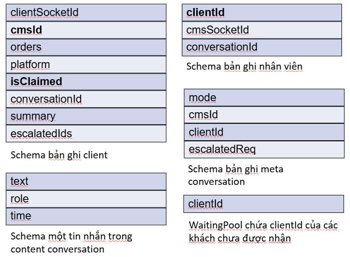

> **message_queue**: chứa tin nhắn của khách hàng chưa được nhận

#### MongoDB
**Cấu trúc:**
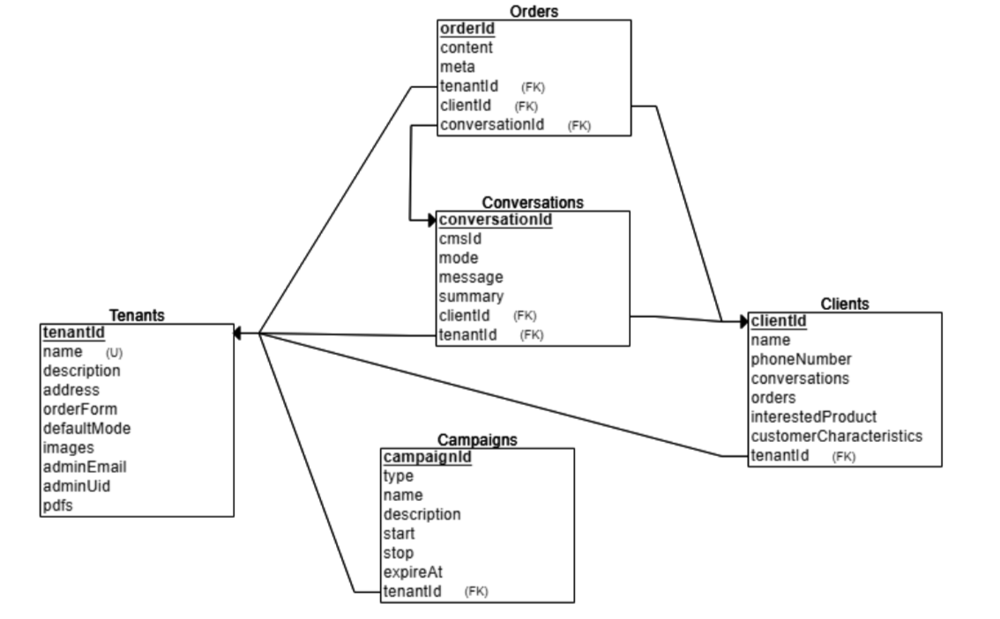

---

### 🔄 Workflow sinh phản hồi

#### Kiến trúc langGraph
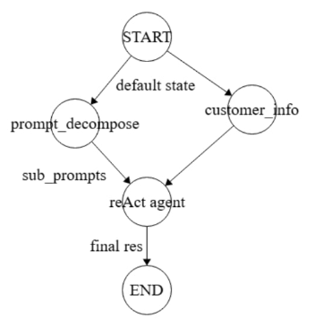

**Node reAct agent:** phối hợp 2 agent & 1 RAG pipeline

**Node decompose:**
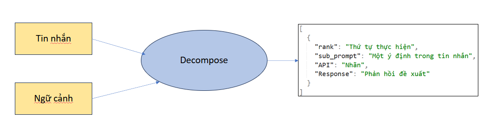
> Nhận truy vấn đa ý định, trả về mảng ý định. VD: "tôi muốn A, tôi muốn B" → `["muốn A", "muốn B"]`

#### Kiến trúc ReAct agent
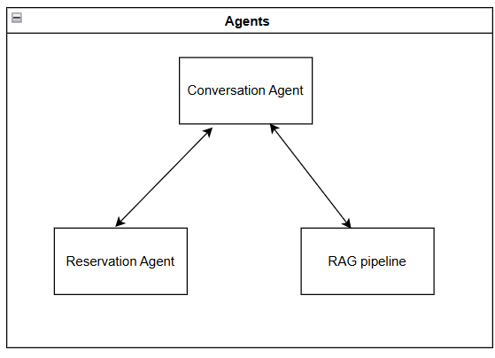

#### Agent Conversation
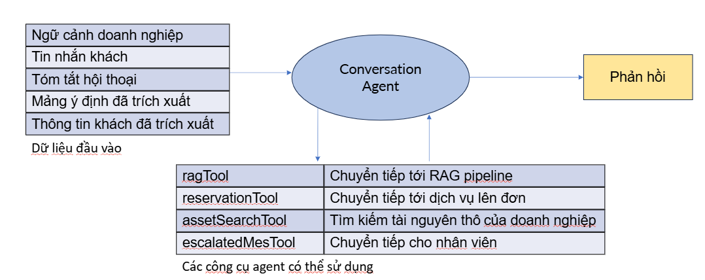

#### Agent Reservation
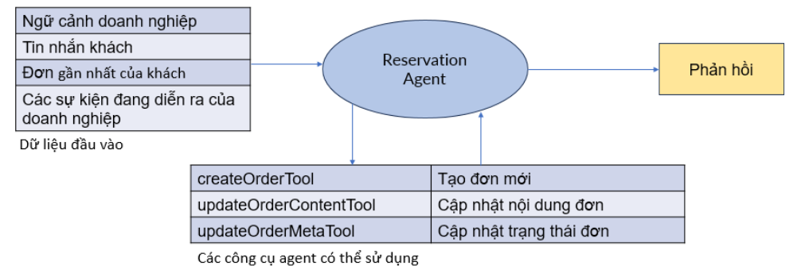

#### RAG pipeline
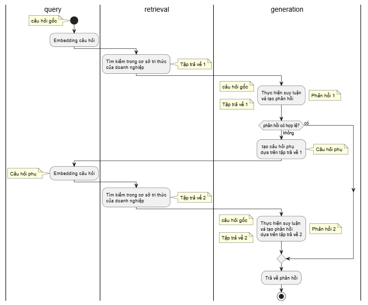

**Logic tìm kiếm:**
1. Lần 1: hệ số alpha 0.7 (gần tìm kiếm vector) → tìm kiếm rộng
2. Lần 2: hệ số alpha 0.3 (gần tìm kiếm text)

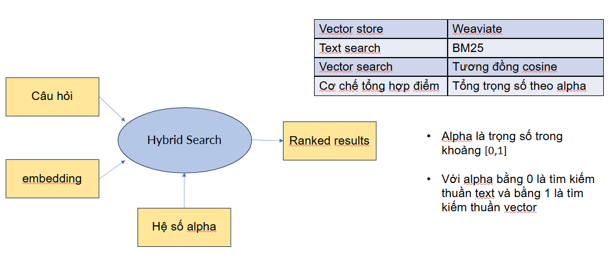

---

### 🗃️ Hệ quản trị nội dung
**Các chức năng của hệ quản trị nội bộ:**
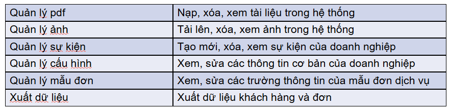

---

## 3. Hướng dẫn cài đặt

### 1️⃣ Giới thiệu

**Các dịch vụ chính:**

- **Internal_service:** Quản trị nội bộ, CRUD dữ liệu doanh nghiệp
- **LLM_service:** Sinh phản hồi
- **Action_service:** Xử lý nghiệp vụ
- **Websocket_service:** Duy trì hội thoại thời gian thực
- **Kafka_service:** Chứa docker compose của Kafka

---

### 2️⃣ Hướng dẫn setup môi trường

Đồ án được xây dựng hoàn toàn bằng **JavaScript** với runtime là **Node.js** nên việc cài đặt Node.js và npm là bắt buộc để chạy.

**Thứ tự setup:**
Kafka_service → Internal_service → RAG_service → LLM_service → Websocket_service → frontend

#### kafka
1. Cài Docker nếu chưa có
2. Chạy: `docker compose -f kafka.yml start`

#### Internal_service
1. `npm install`
2. Đọc file `env.example` và tạo file `.env` tương ứng:
    - Tạo 1 cluster MongoDB miễn phí trên https://cloud.mongodb.com/
    - Tạo DB tên **CSKH** với các collection: `campaigns`, `clients`, `conversations`, `orders`, `tenants`
    - Import dữ liệu tương ứng các collection ở thư mục `data`
3. Setup FireBase:
    - Truy cập https://console.firebase.google.com
    - Tạo project mới
    - Bật Firebase Authentication (Build > Authentication > Sign-in method > bật Google)
    - Vào Project Settings > Service accounts > Generate new private key
    - Lưu file JSON với tên `FirebaseKey.json` vào cùng mức với file `.env` của Internal_service

#### Action_service
1. `npm install`
2. Đọc file `env.example` và tạo file `.env` tương ứng:
    - **GEMINI:** Lấy GEMINI_API_KEY tại https://aistudio.google.com/app/apikey
    - **WEAVIATE:** Đăng ký https://console.weaviate.cloud, tạo cluster, lấy WEAVIATE_URL, WEAVIATE_API_KEY, tạo collection DocumentCollection, bật multi-tenant
    - **MONGO:** MONGO_URI lấy ở bước trước
    - **REDIS:** Đăng ký https://redis.io/try-free/, tạo instance, lấy REDIS_USERNAME, REDIS_PORT, REDIS_HOST, REDIS_PASSWORD
    - **CLOUDINARY:** Đăng ký https://cloudinary.com, lấy CLOUDINARY_CLOUD, CLOUDINARY_API_KEY, CLOUDINARY_API_SECRET

#### LLM_service
1. `npm install`
2. Đọc file `env.example` và tạo file `.env` tương ứng:
    - GEMINI_API_KEY, REDIS_USERNAME, REDIS_PASSWORD, REDIS_HOST, REDIS_PORT, MONGO_URI đã lấy ở các bước trước

#### Websocket_service
1. `npm install`
2. Đọc file `env.example` và tạo file `.env` tương ứng:
    - GEMINI_API_KEY, REDIS_USERNAME, REDIS_PASSWORD, REDIS_HOST, REDIS_PORT, MONGO_URI đã lấy ở các bước trước

#### frontend
1. `npm install`

---

### 3️⃣ Chạy các dịch vụ

**Thứ tự:** Internal_service → RAG_service → LLM_service → Websocket_service → frontend

```sh
cd Internal_service && node index.js
cd Action_service && node index.js
cd LLM_service && node index.js
cd Websocket_service && node index.js
cd frontend && npm run start
```


